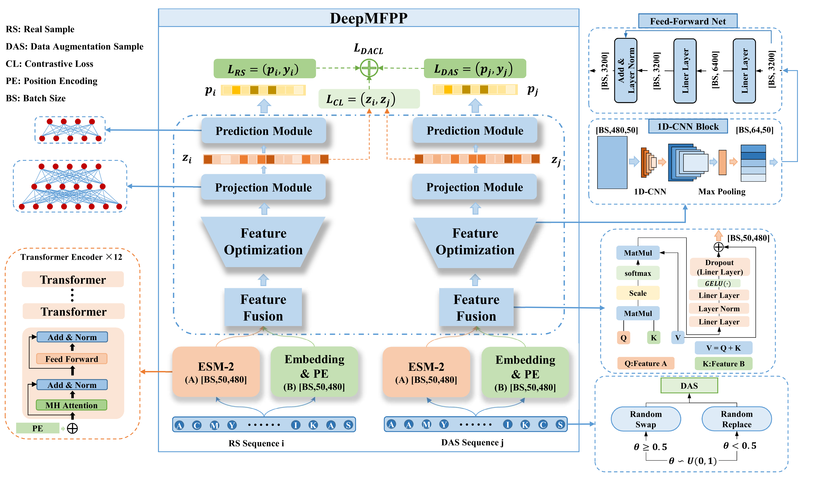

# DeepMFPP
Multi-Functional Peptides Prediction Based on Data Augmentation and Contrastive Learning.

# Introduction
## Abstract
As important potential therapeutic drugs, multi-functional peptides (MFPs) identification is a major challenge in the field of medicine. For identifying the different functional characteristics, many multi-label computational methods have been proposed. These methods improved the efficiency of MFPs discovery, and achieved some success. However, these methods ignore the influence of the Long-Tail label distribution on the prediction accuracy. To further improve the accuracy of MFPs prediction, we introduced a novel deep learning approach DeepMFPP, which utilized data augmentation techniques and contrastive learning to solve the Tail-End problem. The 1:1 data augmentation based on random replace and random swap was conducted on the certain Tail-End samples. For the MFPs representations, the semantic information obtained from ESM-2 and the positional information are fused with self-attention-based method. Then with the feature optimization and projection modules, we could acquire the robust representation of MFPs. DeepMFPP outperforms the state-of-the-art methods for MFPs prediction, with the key metrics Accuracy is 0.702, and Absolute True is 0.633. On additional external datasets, DeepMFPP exhibits excellent extensibility (Accuracy: 0.802, and Absolute True: 0.795), potentially unifying the paradigm framework for MFPs prediction task. 

## Key points
- In this study, we proposed a novel method for predicting MFPs based on DA and CL, 
outperforming the state-of-the-art method.
- We employed two types DAOs, DAO-RR and DAO-RS, for targeted augmentation Tail-End 
MFPs, and integrating it with CL, established the DA-CL learning framework. This approach 
effectively addresses the few-shot learning challenges inherent in MFPs prediction.
- A novel feature fusion method SAF was devised to facilitate effective interaction and alignment 
between the two types sequence representations. This aids the model in acquiring robust 
peptide representations conducive to MFPs prediction.
- We designed a loss function tailored for the DA-CL framework to guide model learning 
and subsequently enhanced the MFPs prediction accuracy.
- Web server for MFPs prediction: https://huggingface.co/spaces/xiaoleon/DeepMFPP-hf.

## Description of relevant files
|Files name      |Description |
|----------------|------------|
|data            | Raw data and DA data used in this study |
|ESM2            | Protein Pretraining Language Model ESM-2 |
|attention.py    | DeepPD and Other algorithms involved in this study |
|config.py       | DeepMFPP configuration file |
|data_process.py | Data preprocessing and format conversion script |
|evaluation.py   | evaluating indicator |
|LossFunction.py | loss functions |
|main.py         | model training script|
|model.py        | DeepMFPP model |
|modules.py      | the necessary model components for building DeepMFPP |
|utils.py        | Some necessary component units |

## Citation
Not available at the moment.